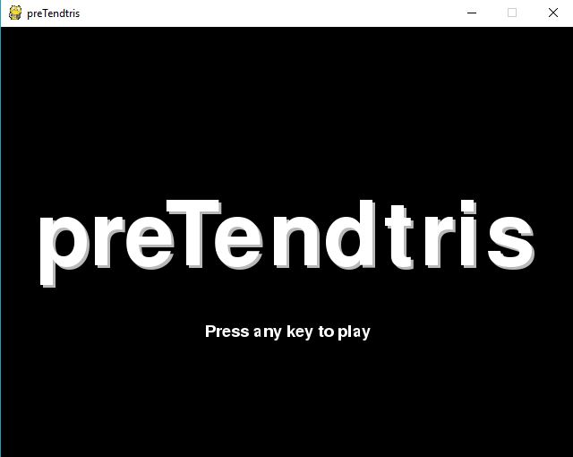
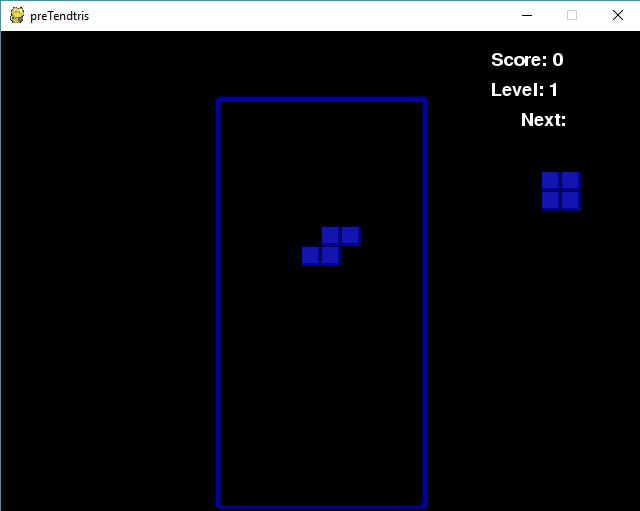
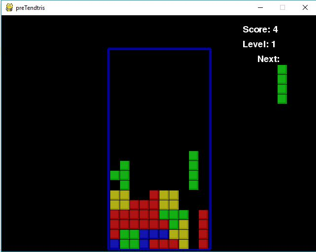
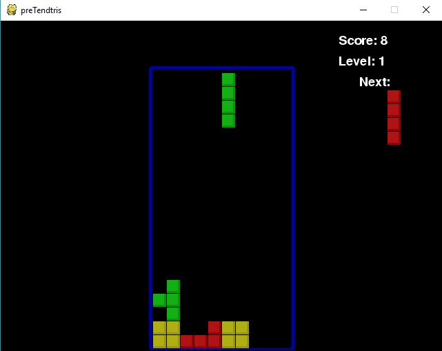

# preTendtris

## Play a non-copyrighted version of Pretendtris on your local machine!

## Programs Needed:
[Python](https://www.python.org/)  
[PyGames](https://www.pygame.org/wiki/GettingStarted)

### To Run:
```
python preTendtris.py
```
### Controls:
A or left arrow key = move to the left   
D or right arrow key = move to the right  
W or up arrow key = rotate the pieces  
D S or down arrow key = move the pieces down faster  

ScreenShots:
1) The beginning page that you'll see  


2) Play the game! Be careful as the pieces drop!  


3) As you fit the pieces...  


4) You get points!  

